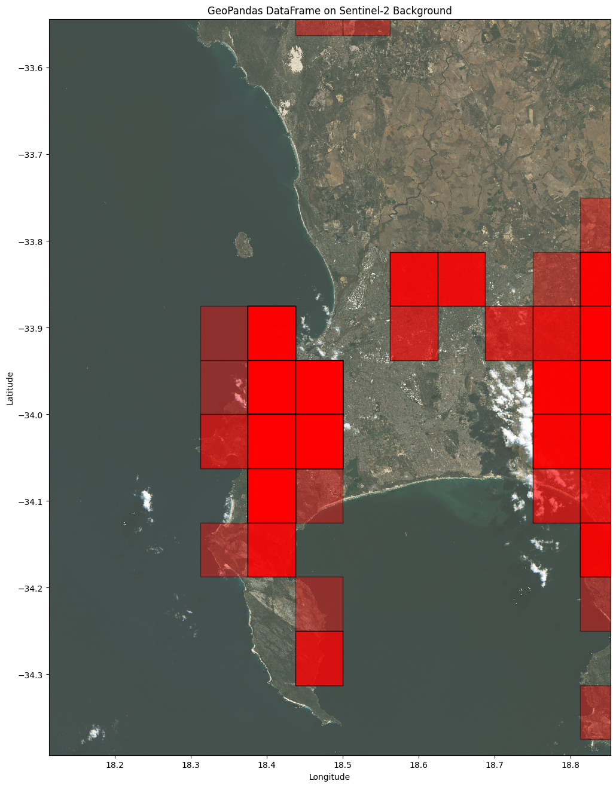

# B-Cubed DEMO Living Planet Symposium 2025
Maarten Trekels
## Building data cubes


### Install missing packages


```python
%pip install pygbif
%pip install dask
%pip install geopandas
%pip install netCDF4
%pip install rioxarray
%pip install cartopy
%pip install basemap
%pip install xarray-spatial
%pip install contextily
%pip install pystac_client
%pip install planetary_computer
%pip install stackstac
```

### Loading packages


```python
import warnings
warnings.filterwarnings("ignore", message="invalid value encountered in cast")

from pygbif import occurrences as occ
import pandas as pd
import geopandas as gpd
from pyproj import Proj, Transformer
from shapely.geometry import mapping
from shapely.geometry import Polygon
import matplotlib.pyplot as plt


import io
from io import StringIO
import zipfile
import math
from rioxarray.rioxarray import _make_coords
from rasterio.vrt import WarpedVRT

import xrspatial.multispectral as ms

import contextily as ctx
from pystac_client import Client
from pystac.extensions.eo import EOExtension as eo
import rioxarray
import planetary_computer
import affine
import rasterio  # Import rasterio!
import stackstac
```

### Loading Earth Engine

### Example of the GBIF API through pygbif


```python
from pygbif import occurrences
data = occurrences.search(speciesKey=5229490, limit=10)

print(data['results'])
```

## GBIF data Cubes

### Generating the Cube

#### Exemplar JSON query for generating a data cube


```
# DON'T EXECUTE THIS CELL. FOR DEMO PUPOSE ONLY #
{
  "sendNotification": true,
  "notificationAddresses": [
    "maarten.trekels@plantentuinmeise.be"
  ],
  "format": "SQL_TSV_ZIP",
  "sql": "SELECT  PRINTF('%04d-%02d', \"year\", \"month\") AS yearMonth,
   GBIF_EEARGCode(10000, decimalLatitude,  decimalLongitude,  COALESCE(coordinateUncertaintyInMeters, 1000) ) AS eeaCellCode,
   speciesKey,
   species,
   establishmentMeans,
   degreeOfEstablishment,
   pathway,
   COUNT(*) AS occurrences,
   COUNT(DISTINCT recordedBy) AS distinctObservers
   FROM  occurrence
   WHERE occurrenceStatus = 'PRESENT'
   AND countryCode = 'BE'
   AND hasCoordinate = TRUE
   AND NOT ARRAY_CONTAINS(issue, 'ZERO_COORDINATE')
   AND NOT ARRAY_CONTAINS(issue, 'COORDINATE_OUT_OF_RANGE')
   AND NOT ARRAY_CONTAINS(issue, 'COORDINATE_INVALID')
   AND NOT ARRAY_CONTAINS(issue, 'COUNTRY_COORDINATE_MISMATCH')
   AND \"month\" IS NOT NULL
   GROUP BY yearMonth,
   eeaCellCode,
   speciesKey,
   species,
   establishmentMeans,
   degreeOfEstablishment,
   pathway
   ORDER BY  yearMonth DESC,
   eeaCellCode ASC,
   speciesKey ASC"
}


```


## Loading the Data Cube in Python

### Matching the GBIF download with a geometry

ONLY EXECUTE THIS SECTION IF YOU DON'T WANT TO USE THE PRE GENERATED GEOPARQUET FILES

You can download a pre generated data cube from GitHub or any other online resource.

#### Get data from Drive


```python
def convert_to_int(x):
       try:
           return int(x)
       except ValueError:
           return pd.NA  # or np.nan if you prefer NumPy NaNs

data = pd.read_csv('./data/YOUR_GBIF_DOWNLOAS.csv', sep='\t', converters={'familykey': convert_to_int, 'specieskey': convert_to_int})

data['familykey'] = pd.to_numeric(data['familykey'], errors='coerce').astype('Int64')
data['specieskey'] = pd.to_numeric(data['specieskey'], errors='coerce').astype('Int64')

```


```python
print(data)
```

#### Getting a Geopackage file from the Grid that you use


```python
input_file = "./data/YOUR_GRID.gpkg"

qdgc_ref = gpd.read_file(input_file, layer='tbl_qdgc_03')
```


```python
print(qdgc_ref)
```

#### Merging the Data cube with the grid


```python
test_merge = pd.merge(data, qdgc_ref, left_on='qdgccode', right_on='qdgc')
```


```python
# Convert to GeoDataFrame

gdf = gpd.GeoDataFrame(test_merge, geometry='geometry')

gdf = gdf.set_crs(epsg=4326, inplace=False)
```

## Loading the data from a GeoParquet file

### Loading the data as GeoDataFrames


```python
gbif_cube = './data/data_ZA.parquet'
gbif_points = './data/data_ZA_occurrence.parquet'

gdf_cube = gpd.read_parquet(gbif_cube)
gdf_point = gpd.read_parquet(gbif_points)
```


```python
print(gdf_cube)
```

           kingdom  kingdomkey        phylum  phylumkey          class  classkey  \
    0      Plantae           6  Tracheophyta    7707728  Magnoliopsida       220   
    1      Plantae           6  Tracheophyta    7707728  Magnoliopsida       220   
    2      Plantae           6  Tracheophyta    7707728  Magnoliopsida       220   
    3      Plantae           6  Tracheophyta    7707728  Magnoliopsida       220   
    4      Plantae           6  Tracheophyta    7707728  Magnoliopsida       220   
    ...        ...         ...           ...        ...            ...       ...   
    11040  Plantae           6  Tracheophyta    7707728  Magnoliopsida       220   
    11041  Plantae           6  Tracheophyta    7707728  Magnoliopsida       220   
    11042  Plantae           6  Tracheophyta    7707728  Magnoliopsida       220   
    11043  Plantae           6  Tracheophyta    7707728  Magnoliopsida       220   
    11044  Plantae           6  Tracheophyta    7707728  Magnoliopsida       220   
    
             order  orderkey    family  familykey  ... phylumcount  classcount  \
    0      Fabales      1370  Fabaceae       5386  ...           1           1   
    1      Fabales      1370  Fabaceae       5386  ...           1           1   
    2      Fabales      1370  Fabaceae       5386  ...           1           1   
    3      Fabales      1370  Fabaceae       5386  ...           1           1   
    4      Fabales      1370  Fabaceae       5386  ...           1           1   
    ...        ...       ...       ...        ...  ...         ...         ...   
    11040  Fabales      1370  Fabaceae       5386  ...           1           1   
    11041  Fabales      1370  Fabaceae       5386  ...           1           1   
    11042  Fabales      1370  Fabaceae       5386  ...           1           1   
    11043  Fabales      1370  Fabaceae       5386  ...           1           1   
    11044  Fabales      1370  Fabaceae       5386  ...           1           1   
    
          ordercount  familycount genuscount occurrences  mintemporaluncertainty  \
    0              1            1          1           1                      60   
    1              1            1          1           1                      60   
    2              1            1          1           1                   86400   
    3              1            1          1           1                      60   
    4              1            1          1           1                      60   
    ...          ...          ...        ...         ...                     ...   
    11040          1            1          1           1                       1   
    11041          1            1          1           1                      60   
    11042          1            1          1           1                   86400   
    11043          1            1          1           1                   86400   
    11044          1            1          1           1                   86400   
    
           mincoordinateuncertaintyinmeters     cellCode  \
    0                             1575268.0  E009S27CCBD   
    1                                  19.0  E016S28BDCA   
    2                                1000.0  E016S28CBBD   
    3                                  31.0  E016S28DAAC   
    4                                1000.0  E016S28DAAC   
    ...                                 ...          ...   
    11040                               4.0  E031S29CABC   
    11041                              61.0  E031S29CCAA   
    11042                            1000.0  E031S29CCBC   
    11043                            1000.0  E031S29CCBC   
    11044                            1000.0  E031S29CCDA   
    
                                                    geometry  
    0      POLYGON ((9.1875 -27.875, 9.25 -27.875, 9.25 -...  
    1      POLYGON ((16.75 -28.4375, 16.8125 -28.4375, 16...  
    2      POLYGON ((16.4375 -28.625, 16.5 -28.625, 16.5 ...  
    3      POLYGON ((16.5 -28.625, 16.5625 -28.625, 16.56...  
    4      POLYGON ((16.5 -28.625, 16.5625 -28.625, 16.56...  
    ...                                                  ...  
    11040  POLYGON ((31.125 -29.625, 31.1875 -29.625, 31....  
    11041  POLYGON ((31 -29.8125, 31.0625 -29.8125, 31.06...  
    11042  POLYGON ((31.125 -29.875, 31.1875 -29.875, 31....  
    11043  POLYGON ((31.125 -29.875, 31.1875 -29.875, 31....  
    11044  POLYGON ((31.125 -29.9375, 31.1875 -29.9375, 3...  
    
    [11045 rows x 27 columns]


### Filtering data (e.g. on species)
Check for a single species (Acacia melanoxylon R.Br.: https://www.gbif.org/species/2979000)


```python
gdf_cube = gdf_cube[gdf_cube['specieskey'].eq(2979775)]
gdf_point = gdf_point[gdf_point['speciesKey'].eq(2979775.0)]
```

## Visualization of the data cubes on a map with different layers

### Plotting the data on OpenStreetMap


```python


bbox_total = gdf_cube.total_bounds

bbox = [18.113532, -34.393312, 18.852118, -33.543684] #ZA bbox

aoi = {
    "type": "Polygon",
    "coordinates": [[
        [bbox[0], bbox[1]],
        [bbox[2], bbox[1]],
        [bbox[2], bbox[3]],
        [bbox[0], bbox[3]],
        [bbox[0], bbox[1]],
    ]],
}


# 5. Plot the Data
fig, ax = plt.subplots(figsize=(20, 16))


# Plot the GeoDataFrames
gdf_cube.plot(ax=ax, color="red", edgecolor="black", linewidth=1, alpha=0.5)
gdf_point.plot(ax=ax, color="blue", edgecolor="black", linewidth=1, alpha=0.5)

# Adjust Axes
ax.set_xlim(bbox[0], bbox[2])
ax.set_ylim(bbox[1], bbox[3])

ctx.add_basemap(ax, source=ctx.providers.OpenStreetMap.Mapnik, crs="EPSG:4326")


# Labels and Title
plt.title("GeoPandas DataFrame on OpenStreetMap Background")
plt.xlabel("Longitude")
plt.ylabel("Latitude")

# Show the Plot
plt.show()
```


    

    


### Getting Sentinel-2 image from Microsoft Planetary Computer


```python
catalog = Client.open("https://planetarycomputer.microsoft.com/api/stac/v1", modifier=planetary_computer.sign_inplace)


items = catalog.search(
    collections=["sentinel-2-l2a"],
    query={"id": {"eq": "S2B_MSIL2A_20250404T081609_R121_T34HBH_20250404T120818"}}
).items()


least_cloudy_item = next(items)

print(
    f"Choosing {least_cloudy_item.id} from {least_cloudy_item.datetime.date()}"
    f" with {eo.ext(least_cloudy_item).cloud_cover}% cloud cover"
)

scene_data = (
    stackstac.stack(
        [least_cloudy_item.to_dict()],
        epsg=4326,
        resampling=rasterio.enums.Resampling.bilinear,
        #resolution=0.001,  # resolution in the output CRS’s units
        assets=["B04", "B03", "B02"],  # red, green, blue bands
        chunksize=2048,
    )
    .isel(time=0)
    .persist()
)

scene_data
```

    Choosing S2B_MSIL2A_20250404T081609_R121_T34HBH_20250404T120818 from 2025-04-04 with 2.005319% cloud cover


### Overlaying Cube With Sentinel data


```python
import matplotlib.pyplot as plt
import xrspatial.multispectral as ms

#... (your code to generate scene_data and filtered_gdf)

# 5. Plot the Data
fig, ax = plt.subplots(figsize=(20, 16))

# Create the true-color image
sentinel_img = ms.true_color(*scene_data)  # No need for name="epsg=4326" here

# Plot the Sentinel-2 image on the existing axes
sentinel_img.plot.imshow(ax=ax, add_colorbar=False)  # Plot on 'ax', remove extra colorbar

# Plot the GeoDataFrame on the same axes
gdf_cube.plot(ax=ax, color="red", edgecolor="black", linewidth=1, alpha=0.4)

# Adjust Axes
ax.set_xlim(bbox[0], bbox[2])
ax.set_ylim(bbox[1], bbox[3])

# Labels and Title
plt.title("GeoPandas DataFrame on Sentinel-2 Background")
plt.xlabel("Longitude")
plt.ylabel("Latitude")

# Show the Plot
plt.show()
```


    

    


## EBV data cubes in NetCDF format


```python
import netCDF4 as nc
import xarray as xr


birds_file = xr.open_dataset('./data/viti_spepop_id77_20240206_v1.nc')

print(birds_file)
```

    <xarray.Dataset> Size: 26kB
    Dimensions:  (lon: 559, lat: 437, time: 1, entity: 486)
    Coordinates:
      * lon      (lon) float64 4kB 9.45e+05 9.55e+05 ... 6.515e+06 6.525e+06
      * lat      (lat) float64 3kB 5.305e+06 5.295e+06 ... 9.55e+05 9.45e+05
      * time     (time) datetime64[ns] 8B 2018-01-01
      * entity   (entity) |S37 18kB b'Gavia stellata                       ' ... ...
    Data variables:
        crs      |S1 1B ...
    Attributes: (12/38)
        Conventions:                CF-1.8, ACDD-1.3, EBV-1.0
        naming_authority:           The German Centre for Integrative Biodiversit...
        history:                    EBV netCDF created using ebvcube, 2024-02-06
        ebv_vocabulary:             https://portal.geobon.org/api/v1/ebv
        ebv_cube_dimensions:        lon, lat, time, entity
        keywords:                   ebv_class: Species populations, ebv_name: Spe...
        ...                         ...
        geospatial_lat_units:       meter
        time_coverage_start:        2013-01-01
        time_coverage_end:          2018-12-31
        time_coverage_resolution:   P0000-00-00
        date_issued:                2024-02-12
        comment:                    List of species: https://cdr.eionet.europa.eu...


```python
def print_netcdf_structure(nc_file_path):
  """Prints the structure (groups, variables, and their paths) of a NetCDF file.

  Args:
    nc_file_path: Path to the NetCDF file.
  """
  def print_group_structure(group, path=""):
    """Recursively prints the structure of a group within the NetCDF file."""
    for var_name in group.variables:
      print(f"{path}/{var_name}")  # Print variable path
    for group_name in group.groups:
      subgroup = group.groups[group_name]
      print_group_structure(subgroup, f"{path}/{group_name}")  # Recursively explore subgroups

  with nc.Dataset(nc_file_path, 'r') as nc_file:
    print_group_structure(nc_file)  # Start with the root group

# Example usage:
nc_file_path = './data/viti_spepop_id77_20240206_v1.nc'
print_netcdf_structure(nc_file_path)
```

    /lon
    /lat
    /time
    /crs
    /entity
    /metric_1/ebv_cube


```python
print(birds_file.variables)
```

    Frozen({'lon': <xarray.IndexVariable 'lon' (lon: 559)> Size: 4kB
    array([ 945000.,  955000.,  965000., ..., 6505000., 6515000., 6525000.])
    Attributes:
        long_name:      lon
        standard_name:  projection_x_coordinate
        axis:           X
        units:          meter, 'lat': <xarray.IndexVariable 'lat' (lat: 437)> Size: 3kB
    array([5305000., 5295000., 5285000., ...,  965000.,  955000.,  945000.])
    Attributes:
        long_name:      lat
        standard_name:  projection_y_coordinate
        axis:           Y
        units:          meter, 'time': <xarray.IndexVariable 'time' (time: 1)> Size: 8B
    array(['2018-01-01T00:00:00.000000000'], dtype='datetime64[ns]')
    Attributes:
        long_name:  time
        axis:       T, 'crs': <xarray.Variable ()> Size: 1B
    [1 values with dtype=|S1]
    Attributes:
        spatial_ref:                     PROJCRS["ETRS89-extended / LAEA Europe",...
        GeoTransform:                    940000 10000 0.0 5310000 0.0 -10000
        grid_mapping_name:               lambert_azimuthal_equal_area
        latitude_of_projection_origin:   52.0
        longitude_of_projection_origin:  10.0
        false_easting:                   4321000.0
        false_northing:                  3210000.0
        semi_major_axis:                 6378137.0
        inverse_flattening:              298.257223563
        longitude_of_prime_meridian:     0.0
        long_name:                       CRS definition, 'entity': <xarray.IndexVariable 'entity' (entity: 486)> Size: 18kB
    array([b'Gavia stellata                       ',
           b'Gavia arctica                        ',
           b'Tachybaptus ruficollis               ', ...,
           b'Accipiter gentilis all others        ',
           b'Melanitta nigra s. str.              ',
           b'Sylvia subalpina                     '], dtype='|S37')
    Attributes:
        units:                           1
        ebv_entity_type:                 Species
        ebv_entity_scope:                Bird species listed under the Art. 12 of...
        ebv_entity_classification_name:  Species names as accepted by the Birds D...
        ebv_entity_classification_url:   https://cdr.eionet.europa.eu/help/birds_...
        long_name:                       entity})


```python
time = birds_file.variables['time']
print(time)

print(birds_file['entity'])
```

    <xarray.IndexVariable 'time' (time: 1)> Size: 8B
    array(['2018-01-01T00:00:00.000000000'], dtype='datetime64[ns]')
    Attributes:
        long_name:  time
        axis:       T
    <xarray.DataArray 'entity' (entity: 486)> Size: 18kB
    array([b'Gavia stellata                       ',
           b'Gavia arctica                        ',
           b'Tachybaptus ruficollis               ', ...,
           b'Accipiter gentilis all others        ',
           b'Melanitta nigra s. str.              ',
           b'Sylvia subalpina                     '], dtype='|S37')
    Coordinates:
      * entity   (entity) |S37 18kB b'Gavia stellata                       ' ... ...
    Attributes:
        units:                           1
        ebv_entity_type:                 Species
        ebv_entity_scope:                Bird species listed under the Art. 12 of...
        ebv_entity_classification_name:  Species names as accepted by the Birds D...
        ebv_entity_classification_url:   https://cdr.eionet.europa.eu/help/birds_...
        long_name:                       entity


```python
import matplotlib.pyplot as plt
import cartopy.crs as ccrs
import cartopy.feature as cfeature
import xarray as xr
import numpy as np
from pyproj import Transformer
from matplotlib.colors import ListedColormap, BoundaryNorm

# --- Load Dataset Efficiently ---
birds_file = xr.open_dataset(
    './data/viti_spepop_id77_20240206_v1.nc',
    group="metric_1",
    chunks={'entity': 1, 'time': 1}  # Load only one entity/time slice at a time
)

# --- Select Target Species and Time ---
species_index = 150  # Change to the species index you need
time_index = 0  # Change to the desired time index

# Extract only the required slice
species_data_subset = birds_file['ebv_cube'].sel(entity=species_index, time=time_index).compute()

# Convert to a 2D array
species_distribution_2d = np.squeeze(species_data_subset)

# --- Load Longitude and Latitude (Only Once) ---
with xr.open_dataset('./data/viti_spepop_id77_20240206_v1.nc') as ds:
    lon = ds['lon'].values  # 1D array (size: 559)
    lat = ds['lat'].values  # 1D array (size: 437)

# --- Create Meshgrid Efficiently ---
lon_grid, lat_grid = np.meshgrid(lon, lat)

# --- Efficient Coordinate Transformation ---
transformer = Transformer.from_crs("epsg:3035", "epsg:4326", always_xy=True)

# Transform the entire 2D meshgrid
lon_deg, lat_deg = transformer.transform(lon_grid, lat_grid)

# --- Create the Plot ---
fig = plt.figure(figsize=(10, 6))
ax = fig.add_subplot(1, 1, 1, projection=ccrs.PlateCarree())

# Add map features
ax.coastlines()
ax.add_feature(cfeature.LAND, edgecolor='black', facecolor='lightgray')

# --- 🔹 Fix: Use Discrete Colormap Without Color Bar ---
unique_values = np.unique(species_distribution_2d)

# If only one value, choose a single solid color
if len(unique_values) == 1:
    cmap = ListedColormap(["red"])  # Single-color for uniform data
    norm = None
else:
    cmap = ListedColormap(["white", "blue"])  # Adjust colors as needed
    norm = BoundaryNorm([0, 0.5, 1], cmap.N)

# --- 🔹 Fix: Use `shading="nearest"` to Ensure Correct Grid Alignment ---
cs = ax.pcolormesh(
    lon_deg, lat_deg, species_distribution_2d,
    transform=ccrs.PlateCarree(),
    cmap=cmap,
    norm=norm,
    shading='nearest'  # Prevents visual distortion
)

# --- 🔹 Completely Remove Color Bar ---
# No `fig.colorbar(cs)`, so no scale bar will be shown

# --- Get the Species Name Efficiently ---
with xr.open_dataset('./data/viti_spepop_id77_20240206_v1.nc') as ds:
    species_name = ds['entity'].values[species_index].decode('utf-8').strip()

# --- Final Plot Customization ---
ax.set_title(f"Species {species_name} Distribution (10x10 km grid) at time {birds_file['time'].values[time_index].item()}")
ax.set_xlabel("Longitude")
ax.set_ylabel("Latitude")

# --- 🔹 Fix: Add Grid Lines to Show Exact 10x10 km Cells ---
gridlines = ax.gridlines(draw_labels=True, linestyle="--", linewidth=0.5, color="black", alpha=0.5)

# Show the plot
plt.show()

```


    

    

